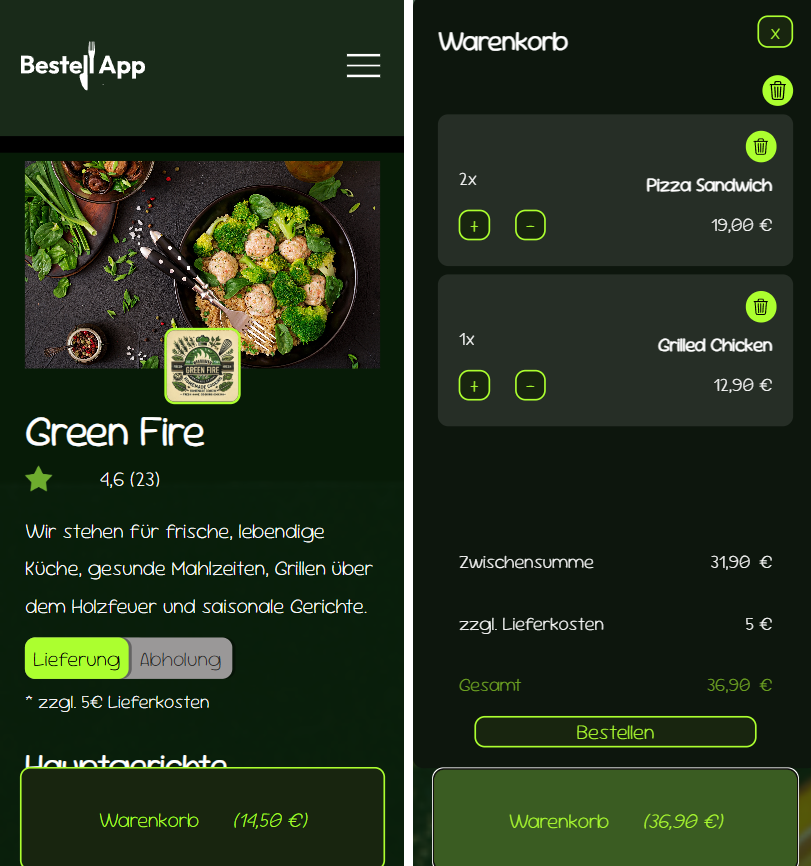
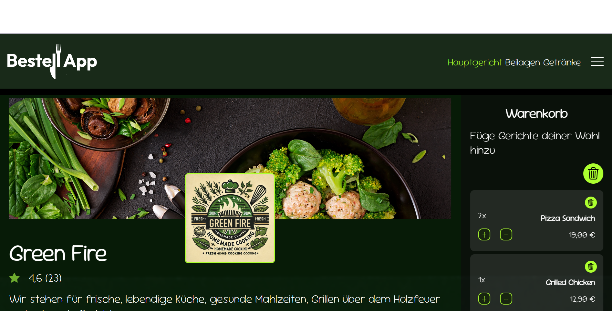

# 🥙 Bestell App - Order, Pick-Up & Delivery

A food ordering application that allows users to browse menus, place orders and choose between delivery or pick-up options. The app is built with HTML, CSS & JavaScript.

## Demo

Live demo: [Try it](https://michelle-bit-web.github.io/bestell-app)

## 🪄 Features

📋 Browse Menus – View detailed menus with descriptions, prices, and images.

🛒 Easy Ordering – Add food and drinks to your cart with a single tap.

🚗 Delivery or Pick-Up – Choose between home delivery or pick-up at the restaurant.

📨 Order – Order your food and you will get an automatic reply.

🗑️ Delete - Delete single menus from the cart or the whole cart.

🔎 Navbar - Use the menu navigation bar to directly switch to a another dishes section.

🧠 Storage - LocalStorage ensures that the user´s recent actions are retained, even after refreshing or reopening the app. 

## 📸 Screenshots

## ⚙️ Technologies Used

- HTML
- CSS
- JavaScript

## 🫳 How to Use

## 🤝 Contributing

Ideas and feedback are welcome! Feel free to open issues or submit pull requests.

##💡To-Dos / Ideas

- [ ] 📍 Real-Time Tracking – Track your order status in real time.

- [ ] 💳 Multiple Payment Options – Pay via credit card, PayPal, or cash on delivery.

- [ ] 🧾 Order History – View past orders and reorder with ease.

- [ ] 💡 Implement Backend.

- [ ] 💡 Improve game logic.
   

